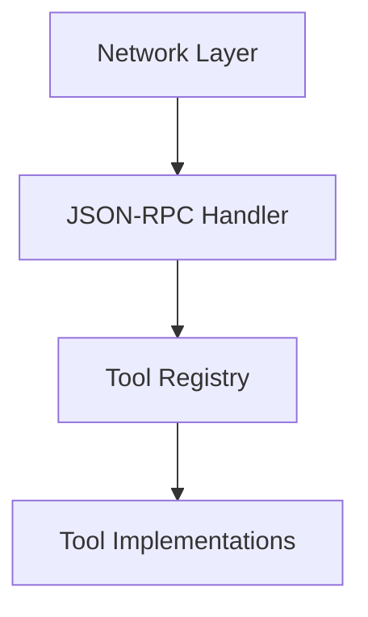

# MCP Server Architecture

## Core Components


### Network Layer (network.zig)
- **TCP/stdio** connection handling
- Thread-per-connection model
- Atomic shutdown flag
- Connection lifecycle management:
  ```zig
  pub const Connection = struct {
      conn_type: ConnectionType,
      reader: std.io.Reader,
      writer: std.io.Writer,
      stream: ?net.Stream,
      id: u32,
      
      pub fn close(self: *Connection) void {
          if (self.stream) |*stream| {
              stream.close();
          }
      }
  };
  ```

### Communication Flow
1. Client establishes connection (TCP/stdio)
2. Network layer reads raw messages
3. JSON-RPC handler processes requests
4. Dispatches to registered tools
5. Responses routed back through connection

## Scalability Features
- Connection hashmap with auto-incrementing IDs
- Non-blocking listener with 100ms sleep
- Per-connection memory buffers (4KB)